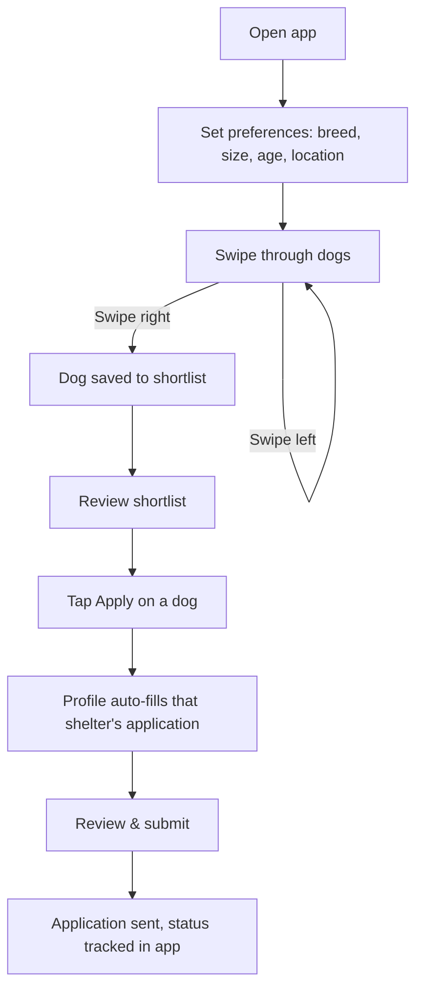
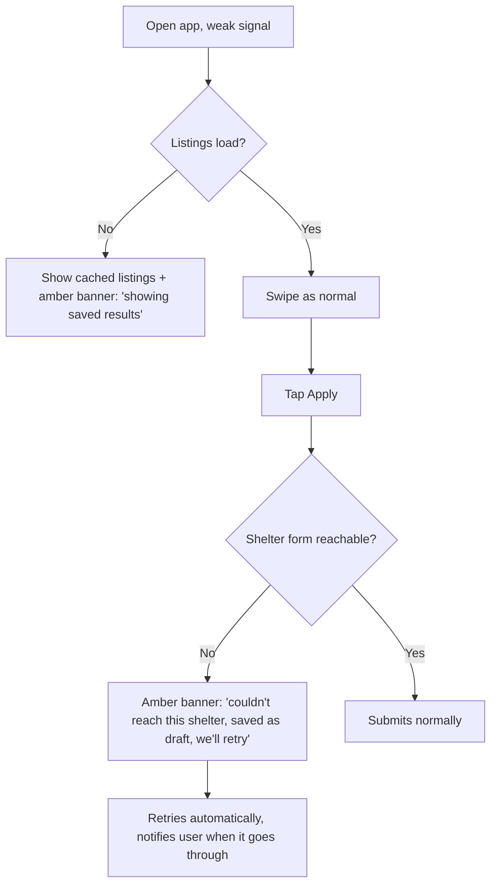
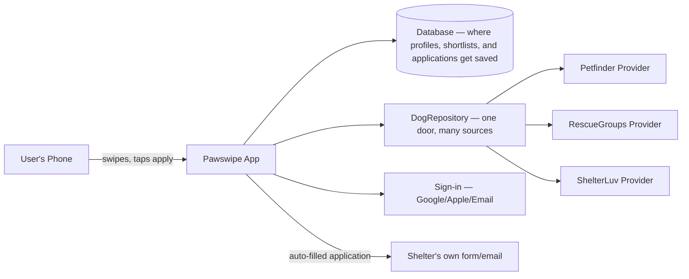
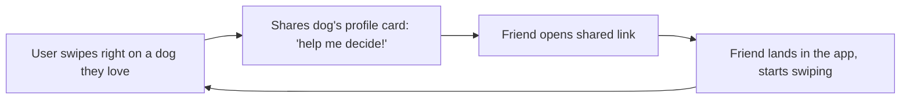

# Pawswipe — Product & Build Plan

*Swipe to shortlist. Tap to apply. No more 8-page forms for a dog you've already lost interest in by the time you finish page 3.*

---

## 1. The Problem

Petfinder-style adoption sites have genuine, documented problems: duplicate and stale listings, broken filters (search "small dog," get pit bulls), a site that freezes and locks people out. But that's not the real killer.

The real killer is what happens *after* you find a dog you love: an 8-page shelter-specific application, repeated for every shelter, followed by silence for weeks, then sometimes a rejection for a vague reason (works too many hours, no fenced yard, "not a stay-at-home parent"). Shelters, meanwhile, get flooded with hundreds of low-effort inquiries they can't triage (one beagle rescue got 800 inquiries and had to shut off new ones entirely).

Nobody in this space has fixed that gap. Every prior "Tinder for dogs" clone (BarkBuddy, GetPet, Ready Pet Go, PawsLikeMe, Tindog, PaWdopt, PawMatch) nailed the fun swipe and ignored the miserable process underneath it. That's likely why none of them broke out.

## 2. The Vision

An app where swiping is the fun front door, and the real value is what's behind it: a single adopter profile that pre-fills any shelter's application, so going from "I love this dog" to "application submitted" takes one tap instead of an hour.

## 3. The Goal

- **What the user is accomplishing:** Adopting a pet that fits their life, without the process draining them.
- **What they do today instead:** Scroll a clunky, duplicate-riddled listing site, then manually fill out a long, shelter-specific application for every dog they like, then wait in silence.
- **Why that sucks:** The fun part (finding a dog you love) is buried under the worst part (repetitive paperwork and silence), so people give up.

*"I'd know this worked if applying to adopt a dog took one tap instead of an hour of retyping the same information."*

## 4. Who It's For

Someone actively researching adoption (not just browsing for fun), overwhelmed by how tedious the process is, and open to a faster, less painful way to apply. First target: people already venting about this in communities like r/DogAdoption and r/rescuedogs.

## 5. User Flows

### Happy Flow



### Rough Day Flow



### Edge Cases

```mermaid
flowchart TD
    A[Dog gets adopted by someone else mid-flow] --> B[Show 'no longer available' + suggest similar dogs]
    C[User already applied to this dog elsewhere] --> D[Warn before duplicate submission]
    E[User returns after 3 months away] --> F[Refresh listings, ask to confirm preferences still valid]
    G[Provider (Petfinder/RescueGroups) API goes down] --> H[DogRepository falls back to next provider automatically]
    I[User wants to delete their account/data] --> J[One clear delete flow, confirms data removed from provider-facing forms too]
```

## 6. Features

### V1 (build now)
- Swipe interface (right = shortlist, left = pass)
- Preference filters (breed, size, age, distance)
- `DogRepository` abstraction pulling from multiple providers (Petfinder, RescueGroups.org, ShelterLuv, room for more)
- One-time adopter profile (housing, experience, household, references)
- One-tap "Apply" that auto-fills a shelter's application from that profile
- Application status tracking (submitted / no response yet / update)
- Share a dog's profile card with a friend ("help me decide")
- Basic account (email + Google/Apple sign-in)

### V2+ (later)
- Premium tier (e.g. unlimited swipes, priority application delivery)
- Direct shelter integrations/pilots (deeper than provider APIs)
- Push notifications for new matches
- In-app messaging with shelters
- Smarter matching (lifestyle-based suggestions, not just filters)

## 7. System Architecture



Data flow in plain words: user sets preferences → `DogRepository` asks each connected provider for matching dogs → app shows them as swipeable cards → right-swipe saves to the Database → tapping Apply pulls the saved adopter profile and fills out that specific shelter's form → submission and its status get logged in the Database so the user can track it.

## 8. Tech Stack

| Tool | What it does | Why | Cost |
|---|---|---|---|
| React Native (via Expo) | Builds one app for iPhone and Android at once | Swiping is a phone-native gesture; a web app fights the interaction | Free |
| Supabase (or Firebase) | Database — saves profiles, shortlists, applications | Managed, handles backups automatically, generous free tier | Free up to a few thousand users |
| Google/Apple Sign-In | Lets people log in without a new password | Standard, low friction, official SDKs only | Free |
| Petfinder / RescueGroups.org / ShelterLuv APIs | Supplies the dog listings | Official SDKs, swappable behind `DogRepository` so no single source is a single point of failure | Free (rate-limited) |
| Apple/Google In-App Purchase | Handles any future premium subscription | Required by app stores for digital features, no separate payment integration needed | Free to integrate, 15-30% cut on paid subscriptions |
| Expo / Vercel (hosting) | Gets the app built and distributed | Standard for React Native, free tier well past launch | Free tier |

## 9. Data Model (plain words)

- **A Dog** has: name, breed, age, size, photos, description, source provider, source listing ID, status (available/pending/adopted).
- **An Adopter Profile** has: housing type, yard/fenced status, work schedule, household members, pet experience, references — the fields most shelter applications ask for.
- **A Shortlist Entry** links a user to a dog they swiped right on.
- **An Application** links a user, a dog, the shelter it was sent to, the data submitted, and its status (submitted / no response / update received).

## 10. House Rules for Your AI

See [HOUSE-RULES.md](HOUSE-RULES.md).

## 11. Integrations

- **Petfinder API, RescueGroups.org API, ShelterLuv API** — each behind a `Provider` implementation of a common `DogRepository` interface, so adding or dropping a source never touches app logic. Use each company's official SDK/API directly, no third-party wrapper.
- **Google/Apple Sign-In** — official SDKs only.
- **Apple/Google In-App Purchase** — official SDKs, for any future premium tier.

## 12. Cost Breakdown

| Service | Free tier | Starts costing at |
|---|---|---|
| Supabase/Firebase | Generous free tier | Roughly thousands of active users |
| Expo/Vercel hosting | Free tier | High traffic / custom domains |
| Petfinder/RescueGroups/ShelterLuv APIs | Free, rate-limited | Rarely a paid tier; watch rate limits |
| Google/Apple Sign-In | Free | Never |
| App Store IAP | Free to integrate | 15-30% cut only on paid subscription revenue |

**Architecture cost warning:** re-fetching listings from providers every time someone opens the app (polling) gets expensive and slow fast. Fetch on a schedule (e.g. every few hours) and cache in your own database instead of hitting provider APIs live on every swipe.

**Complexity score: ~6/10.** More than a to-do list app, less than a social network. The swipe UI is easy; the multi-provider data layer and the auto-fill-application logic are the real work.

## 13. Timeline

- V1 core (swipe, shortlist, profile, one-tap apply, single provider): ~3-4 weeks with AI help
- Multi-provider `DogRepository` + fallback logic: ~1 week
- Polish, error handling, sharing feature: ~1-2 weeks
- Pre-launch prep (legal pages, security pass): ~1 week

## 14. Distribution

**First 10 users:** people actively venting about the adoption process in r/DogAdoption, r/rescuedogs, and local rescue Facebook groups/Nextdoor — the same communities where the pain in this plan was sourced.

**First move:** stand up a simple waitlist landing page before the app is done, and share a short demo (the swipe + one-tap-apply flow) genuinely, not as a spammy plug, in 2-3 of those communities. Aim to have people already waiting by launch day.

## 15. Growth Loop



**Type:** signal/content hybrid — cute, specific dogs are inherently shareable, and the share link drops a new person straight into the core experience. **Track:** the share of new signups that arrive via a shared dog link (a `?ref=` style parameter on every share).

## 16. Things to Handle Before Launch

- **Security (now):** adopter profile data (address, household info) is sensitive — encrypt at rest, never log it in plaintext, API keys live in environment variables, not in code.
- **Privacy & legal (before launch):** privacy policy required (you're collecting personal data), terms of service, and clarity on how shared adopter data is used when auto-filling shelter forms.
- **Accessibility (now):** swipe gesture needs a tap-based alternative (buttons) for anyone who can't swipe reliably.
- **Monitoring (at launch):** error tracking so you find out about a broken provider or failed application submission before your users complain.
- **Backups (now):** handled automatically by Supabase/Firebase's managed tier — confirm it's on.

## 17. Pre-Launch Audits

Run these with your AI tool before showing the app to anyone:

- *Security audit:* "Audit my codebase for security vulnerabilities. Check authentication, authorization, input validation, rate limiting, secrets management, file upload security, CORS/CSRF protections, and timing attacks. Give me a severity rating for each issue found."
- *Scalability audit:* "Audit my codebase for scalability issues. Check for N+1 queries, unbounded database reads, missing pagination, polling vs real-time listeners, caching gaps, cold start performance, and concurrent user handling. Estimate the monthly cost impact of each issue."
- *Production readiness audit:* "Audit my codebase for production readiness. Check for error monitoring, test coverage on payment and authentication paths, accessibility basics, and deployment configuration. Tell me what will fail silently in production."

## 18. Working With Your AI Tool

- Keep your project instruction file under 100 lines; split details into files inside the folders they belong to as it grows.
- Set up logging early: ask your AI to define a debug-logging plan (what to log, levels, category names per feature), write it to `docs/DEBUG-LOGGING.md`, and follow it everywhere.
- Turn off AI-tool plugins/integrations you're not actively using.
- Treat every prompt like a tiny spec: not "add apply button," but "add an Apply button on a saved dog that pulls the adopter profile, fills the shelter's form, shows a spinner while submitting, and shows a friendly retry message if the shelter's form is unreachable."
- Before accepting a fix, ask: "How does this change what my user sees? Will it make the app slower? What does this look like on a bad-signal day?"
- Hold every change to the Definition of Done in Section 10.

## 19. Open Questions

- Whether to run a small pilot with a handful of local shelters (Option B from planning) once V1 proves adopters actually want this.
- Exact shape of the premium tier, if any (unlimited swipes? faster application delivery? something else).
- Whether ShelterLuv's data terms allow the kind of auto-fill described here, worth a quick check before building that provider.

## Words You Now Know

- **API** — a way for two apps to share data with each other.
- **Database** — where your app saves things, like a giant organized spreadsheet.
- **Repository pattern** — one door (`DogRepository`) that many different data sources plug into, so swapping a source doesn't touch the rest of the app.
- **Managed service** — a tool like Supabase that handles the hard infrastructure work (backups, scaling) for you.
- **Environment variables** — a separate, protected place to store secret keys, away from your actual code.
- **In-app purchase (IAP)** — the app store's own payment system, required for digital subscriptions inside mobile apps.
